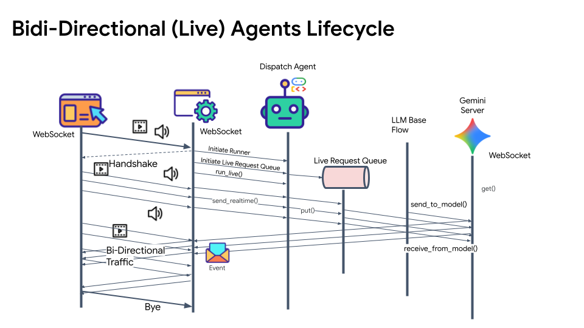
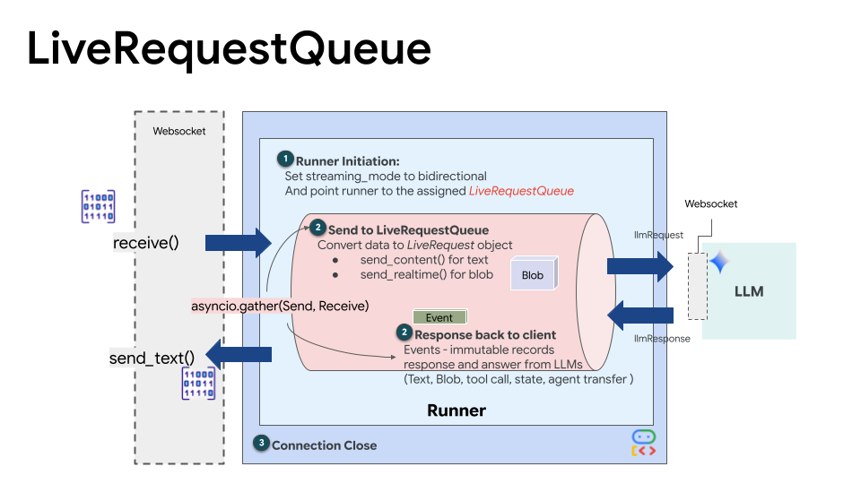
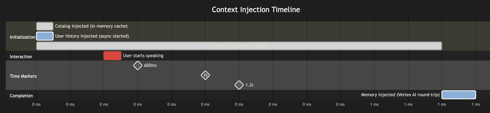
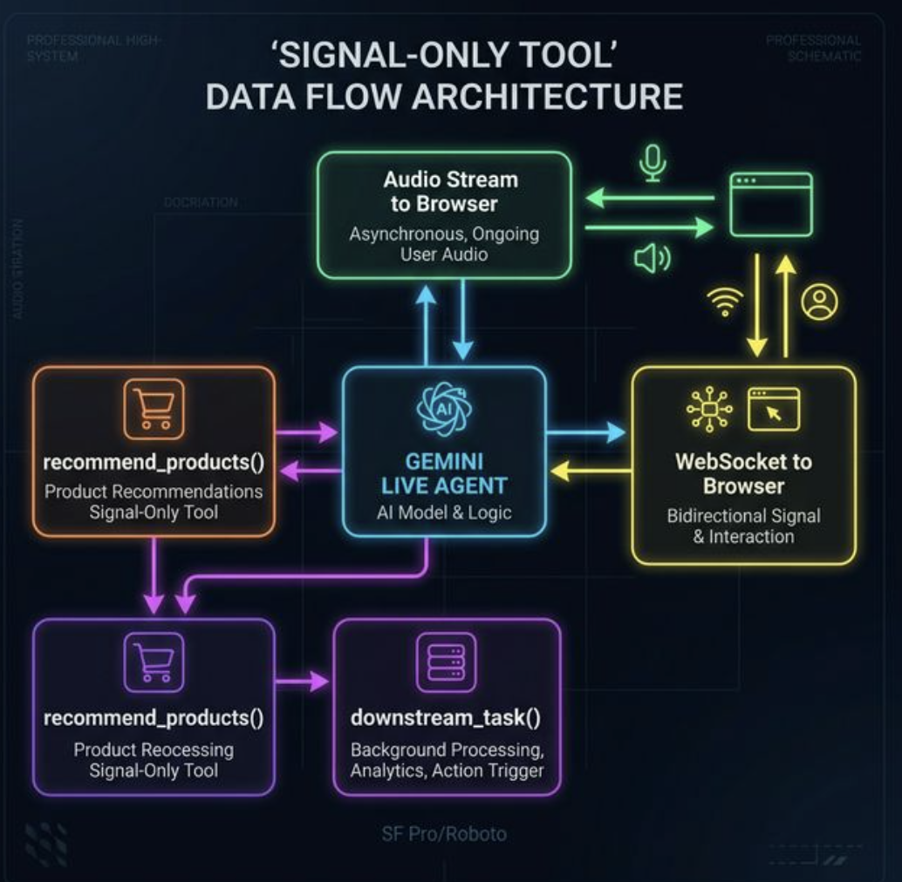
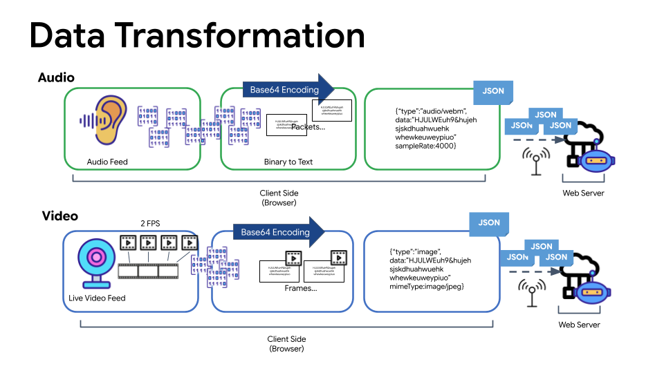

# FashionMind

[](LICENSE)

**A live voice AI fashion stylist powered by Google ADK and Gemini Live.**

Talk to it. Show it your outfit. Ask what's in the store. It answers in the same breath — no search tool call, no extra voice turns, no lag.

🎬 [Watch the demo on YouTube](https://www.youtube.com/watch?v=t8sAL_LQRtk)

---

## What It Does

FashionMind holds a real-time bidirectional voice conversation. In each turn it can:

- **See your outfit** via a 1-fps webcam feed and comment on it naturally
- **Know your history** — upcoming occasions, wishlist, purchases, and style preferences from Cloud SQL
- **Remember across sessions** — style facts persist to Vertex AI Memory Bank and are injected at session start
- **Show you real products** — the full catalog is in the agent's context before you speak your first word; it highlights matching items in the UI the moment it mentions them, with zero extra voice turns

---

## How It Works

### Full System



The backend is a FastAPI WebSocket server running two concurrent `asyncio` tasks tied together by a `LiveRequestQueue`:

- **upstream_task** — receives PCM audio, images, and text from the browser and pushes them into the queue via `send_realtime()` or `send_content()`
- **downstream_task** — iterates `runner.run_live()` events and forwards each one to the frontend as JSON

Both tasks start at `t=0ms`. The session is live immediately — audio flows before context injection even completes.

---

### LiveRequestQueue — The Central Primitive



`LiveRequestQueue` is an `asyncio`-based FIFO queue that decouples the WebSocket handler from the ADK runner. Two methods, completely different behaviors:

| Method | Use for | Behavior |
|---|---|---|
| `send_realtime(Blob)` | Continuous microphone audio | No turn boundary — VAD accumulates the stream and decides when the user stopped speaking |
| `send_content(Content)` | Images, text, context injection | Discrete completed turn — triggers immediate reasoning, can interrupt mid-response |

The rule of thumb: if the user is *continuously doing something* (speaking), use `send_realtime()`. If the user *completed an action* (pressed a button, triggered a snapshot), use `send_content()`.

---

### Context Injection at Session Start



Before the user speaks their first word, three things are injected into the live session via `send_content()`:

| What | How | When |
|---|---|---|
| User identity (`user_id`) | Synchronous | `t = 0ms` |
| Product catalog (~300 tokens) | `asyncio.create_task()` — reads in-memory cache | `t ≈ 5ms` |
| Cross-session style memory | `asyncio.create_task()` — Vertex AI round-trip | `t ≈ 1500ms` |

Because `send_content()` into `LiveRequestQueue` is non-blocking, all three fire at `t=0ms` and the session stays live throughout. The catalog arrives before the user finishes their first sentence. Memory arrives before most first responses complete.

This is why the agent can answer *"do you have any blazers?"* in one voice turn with no search tool call — the catalog is already in context.

---

### Zero-Latency Product Recommendations



The key insight: **any tool call in a voice app costs 2 extra voice turns** (offer → confirm → result = 6–16 seconds wall-clock). So instead of a `search_products()` tool, the catalog is injected as context and the agent reasons over it directly.

`recommend_products(product_ids)` is a **signal-only tool** — it makes no DB query. It exists purely to emit a detectable `function_call` event in the ADK stream:

```python
async def recommend_products(product_ids: list[str]) -> dict:
    """Signal the UI to highlight specific products. No DB query — pure UI signal."""
    return {"status": "ok", "highlighted": len(product_ids)}
```

The downstream task catches the call, cross-references the IDs against `_PRODUCT_CACHE`, and pushes a `product_recommendations` WebSocket event to the frontend — independently of the audio stream. The catalog panel highlights at the exact moment the agent speaks the product name.

**Result: agent speaks + products highlight in the same voice turn, ~200–400ms after the user stops talking.**

---

### Audio Pipeline



The browser captures microphone audio at 16kHz, converts it to 16-bit PCM, and sends it as binary WebSocket frames every ~16ms. The server forwards every frame — including silence — to `send_realtime()`.

> **Always send silence.** Gemini Live's VAD depends on a continuous audio stream. If you gate silence locally, the model loses the signal it needs for turn detection and may never respond.

For barge-in, FashionMind detects speech locally via an RMS threshold and stops audio playback immediately — before the server-side VAD signal propagates back. This gives the UI an instant-feel interrupt without waiting for a network round-trip.

---

## Tech Stack

| Layer | Technology |
|---|---|
| Agent runtime | Google ADK (`google-adk>=1.0.0`) |
| Live model | Gemini Live 2.5 Flash native audio |
| Backend | FastAPI + uvicorn |
| Database | Cloud SQL PostgreSQL via Cloud SQL Python Connector + asyncpg |
| ORM | SQLAlchemy async + Alembic |
| Memory | Vertex AI Memory Bank (Agent Engine) |
| Frontend | React 18 + TypeScript + Tailwind CSS + Vite |

---

## Project Structure

```
fashionmind/
├── backend/
│   ├── main.py                     # FastAPI app, WebSocket bidi endpoint, catalog cache
│   ├── agent/
│   │   ├── agent.py                # ADK Agent, system prompt, tool list
│   │   ├── services.py             # Runner, session service, memory service
│   │   └── tools/
│   │       └── wardrobe_tools.py   # Cloud SQL tools + recommend_products signal tool
│   ├── api/routes/
│   │   ├── users.py
│   │   ├── wardrobe.py
│   │   └── products.py
│   ├── db/
│   │   ├── database.py
│   │   └── models.py
│   ├── requirements.txt
│   └── .env.example
├── frontend/
│   └── src/
│       ├── App.tsx
│       ├── components/
│       │   ├── ConversationPanel.tsx
│       │   └── MerchantCatalogPanel.tsx
│       └── hooks/
│           ├── useADKWebSocket.ts      # WebSocket + event routing
│           ├── useAudioRecorder.ts     # 16kHz PCM capture + barge-in detection
│           └── useWebcamSnapshot.ts    # 1-fps video feed + manual snapshot
├── asset/                          # Architecture diagrams
├── setup_gcp.sh                    # Provisions Cloud SQL + Vertex AI Agent Engine
├── DESIGN_PRODUCT_RECOMMENDATIONS.md
└── DESIGN_VIDEO_SNAPSHOT_STRATEGY.md
```

---

## Quick Start

### Prerequisites

- GCP project with billing enabled
- `gcloud` CLI authenticated
- Python 3.11+
- Node.js 18+

### 1. Provision GCP infrastructure

```bash
./setup_gcp.sh YOUR_PROJECT_ID us-central1
```

Creates a Cloud SQL PostgreSQL instance and Vertex AI Agent Engine, then writes `backend/.env`.

### 2. Backend

```bash
cd backend
python -m venv .venv && source .venv/bin/activate
pip install -r requirements.txt

alembic upgrade head          # run DB migrations
python seed_products.py       # populate the catalog

uvicorn main:app --reload --port 8080
```

Verify the catalog loaded: `GET http://localhost:8080/api/debug/catalog`

### 3. Frontend

```bash
cd frontend
npm install
npm run dev
```

Open `http://localhost:5173`.

---

## Environment Variables

Copy `backend/.env.example` to `backend/.env`:

| Variable | Description |
|---|---|
| `DATABASE_URL` | Cloud SQL asyncpg connection string |
| `PROJECT_ID` / `GOOGLE_CLOUD_PROJECT` | GCP project ID |
| `REGION` / `GOOGLE_CLOUD_LOCATION` | GCP region (e.g. `us-central1`) |
| `AGENT_ENGINE_ID` | Vertex AI Agent Engine resource ID |
| `GOOGLE_GENAI_USE_VERTEXAI` | Set to `TRUE` for Vertex AI backend |
| `USE_MEMORY_BANK` | Set to `true` to enable cross-session memory |
| `DEMO_AGENT_MODEL` | Live model ID (default: `gemini-live-2.5-flash-native-audio`) |

---

## API Reference

| Method | Path | Description |
|---|---|---|
| `POST` | `/api/sessions/{user_id}` | Create an ADK session |
| `WS` | `/ws/{user_id}/{session_id}` | Bidirectional streaming session |
| `GET` | `/api/users/{user_id}/memory` | Fetch Vertex AI Memory Bank contents |
| `GET` | `/api/debug/catalog` | Inspect the in-memory product cache |
| `POST` | `/api/admin/reload-catalog` | Reload cache from DB without restart |

### WebSocket Protocol

**Browser → Server**

| Frame | Description |
|---|---|
| Binary | Raw 16kHz PCM audio (every frame, including silence) |
| `{"type":"image","data":"<base64 JPEG>"}` | Outfit snapshot |
| `{"type":"text","text":"..."}` | Text turn |
| `{"type":"init","user_id":"..."}` | Session init signal |

**Server → Browser**

| Event | Description |
|---|---|
| ADK event JSON | All `runner.run_live()` events forwarded as-is |
| `{"type":"product_recommendations","products":[...]}` | Catalog highlights triggered by `recommend_products()` |

---

## Design Docs

- [DESIGN_PRODUCT_RECOMMENDATIONS.md](DESIGN_PRODUCT_RECOMMENDATIONS.md) — the six product search options evaluated, why context injection wins for voice, signal-only tool pattern, hallucination guard layers
- [DESIGN_VIDEO_SNAPSHOT_STRATEGY.md](DESIGN_VIDEO_SNAPSHOT_STRATEGY.md) — webcam feed architecture, 1-fps streaming vs. manual snapshot tradeoffs

---

## License

Distributed under the [Apache License 2.0](LICENSE).

---

## Known Limitations

- **Catalog injection ceiling** — at ~200 products the per-turn token overhead grows. Mitigation: trim to title + price only, then layer in a pgvector `search_products()` tool.
- **Reload endpoint is unauthenticated** — `POST /api/admin/reload-catalog` needs auth before any production use.
- **`recommend_products()` compliance is prompt-dependent** — if the system prompt is shortened or the model swapped, tool call frequency can drop silently. Worth adding eval coverage.
- **Memory and catalog are static per session** — new preferences enter Memory Bank only after the session ends (by design — avoids per-chunk Vertex AI writes).
